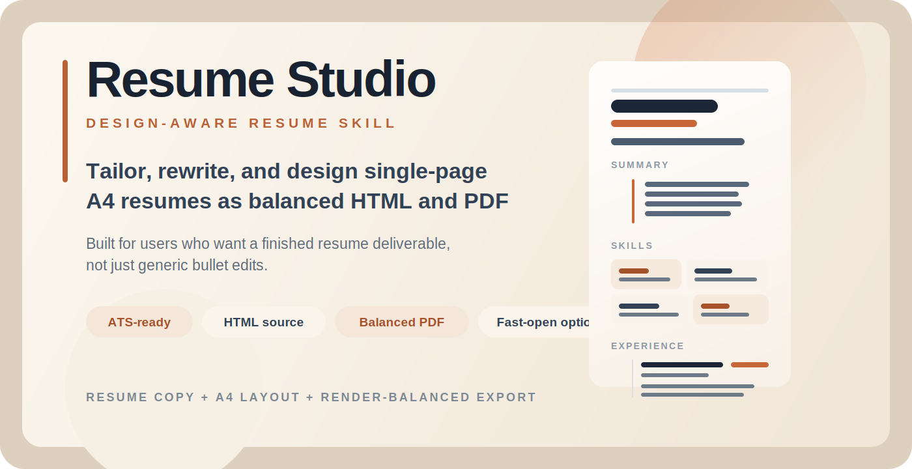

<p align="center">
  
</p>

# Resume Studio

Design-aware resume rewriting and PDF generation for agent workflows.

`resume-studio` improves resume content, tailors it to a target role, and can produce polished single-page A4 resume artifacts as HTML and PDF. It is built for users who want a finished deliverable, not just generic resume advice.

## Why this skill exists

Most resume skills stop at bullet rewriting or ATS cleanup. `resume-studio` treats resume work as both a writing problem and a layout problem:

- improve the content first
- map it to the target role or direction
- design a print-oriented HTML resume
- export a render-balanced PDF
- keep the page dense, readable, and visually balanced

## What it can do

- Rewrite and tighten resume copy
- Tailor resumes to a specific job description
- Convert existing resume PDFs or text into stronger structured content
- Generate ATS-friendly resume variants
- Create designed HTML resumes
- Export single-page A4 PDF resumes
- Optimize layout density to avoid obvious bottom whitespace
- Choose between balanced-design and fast-open PDF output

## Good prompts

- "Tailor my resume to this Staff Frontend Engineer job and give me an ATS version plus a polished PDF."
- "Turn this PDF resume into a better one-page A4 resume and save the HTML source too."
- "Make my resume look better, but don't turn it into a flashy portfolio poster."
- "I want a resume PDF that opens quickly and still feels intentional."

## Install

After this repository is public, install with:

```bash
npx skills add https://github.com/0xMoat/resume-studio --skill resume-studio -g -y
```

## Skill contents

- `resume-studio/SKILL.md`
- `resume-studio/README.md`
- `resume-studio/evals/evals.json`
